[English](#english)

# Speech Bubble Editor for WebUI Forge Neo


Version: **0.5.0**

<a id="日本語"></a>

## 日本語

ComfyUI **Speech Bubble Layer** のHTMLエディターとPillow描画処理を、WebUI Forge Neoで単独動作するよう移植した拡張です。ComfyUIは不要です。

> [!IMPORTANT]
> 現在は開発版です。UI、保存形式、機能構成は今後変更される可能性があります。

## 主な機能

- Speech Bubble、SFX、Comic Stamp、Frame、Text、Emphasis Linesをレイヤーとして配置
- 移動、拡大縮小、回転、複数選択、グループ化、表示切替、ロック、Undo / Redo
- 素材のお気に入り表示と、検索・カテゴリ・並べ替えに対応した素材ブラウザー
- SFX／Comic StampのUser Presetsを作成・再編集し、Fill／Outline、Drop Shadow、Outer Glow、標準／拡大プレビューを設定
- Settings内の非破壊Self Diagnosticsとコピー可能な診断レポート
- 画像ごとのレイアウト保存、単体編集用の独立した保存領域、自動保存下書き
- 背景込みの合成画像（PNG / JPEG / WebP）と、透過Overlay PNGを書き出し

## インストール

Forge Neoの `extensions` フォルダーで次を実行します。

```powershell
git clone https://github.com/ukr8b3g-cmyk/sd-webui-speech-bubble-forge-neo.git
```

またはGitHubからZIPをダウンロードし、展開したフォルダーを `extensions` 直下へ配置します。

```text
stable-diffusion-webui-forge/
└─ extensions/
   └─ sd-webui-speech-bubble-forge-neo/
```

Forge Neoを再起動し、ブラウザーを `Ctrl+F5` で更新してください。追加のpipインストールは不要です。

### ダウンロード・セットアップ関連リンク

- [GitHubリポジトリ](https://github.com/ukr8b3g-cmyk/sd-webui-speech-bubble-forge-neo)
- [最新版ZIPをダウンロード](https://github.com/ukr8b3g-cmyk/sd-webui-speech-bubble-forge-neo/archive/refs/heads/main.zip)
- [インストール補足](docs/INSTALL_USER_PRESETS_V1.md)
- [User Presets操作マニュアル](docs/USER_PRESETS_V1_MANUAL.md)
- [変更履歴](docs/CHANGELOG_0.5.0.md)
- [動作確認項目](VERIFICATION.md)

主要な実装ファイルは、Forge連携の [`scripts/speech_bubble_forge.py`](scripts/speech_bubble_forge.py)、起動・通信処理の [`javascript/speech_bubble_forge.js`](javascript/speech_bubble_forge.js)、Editor本体の [`web/speech-bubble-editor.html`](web/speech-bubble-editor.html)、APIの [`speech_bubble_forge/api.py`](speech_bubble_forge/api.py)、設定定義の [`speech_bubble_forge/settings.py`](speech_bubble_forge/settings.py) です。拡張情報は [`metadata.ini`](metadata.ini)、追加パッケージの有無は [`requirements.txt`](requirements.txt) で確認できます。

## Forge側UI

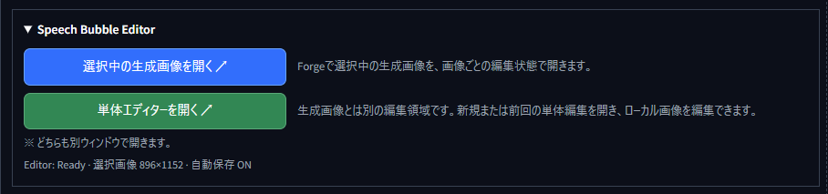

2つのボタンは同じEditor UIを開きますが、開く編集ドキュメントと保存領域は別々です。青いボタンはForgeの選択画像を画像ごとの編集領域で開き、緑のボタンは生成画像から独立した単体編集領域を開きます。片方の編集内容が、もう片方へ自動的に混ざることはありません。

- `Speech Bubble Editor` パネルをtxt2img / img2imgの **Script欄の直前**へ表示します。
- 上段の `選択中の生成画像を開く ↗` は、Forgeギャラリーで選択中の画像を、その画像専用の編集状態で開きます。
- 下段の `単体エディターを開く ↗` は、生成画像とは独立した新規または前回の単体編集を開きます。ローカル画像の編集はこちらを使用します。
- ギャラリー下へ **吹き出し＋斜めペン** アイコンを追加します。
- Editorは常に1ウィンドウだけです。再度押すと既存ウィンドウへフォーカスします。
- Forgeのライト／ダークテーマを自動検出してEditorへ反映します。

### 単体エディターの開始方法

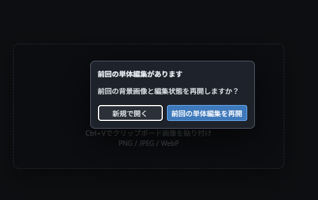

前回の単体編集が残っている場合は、空の編集領域を作る `新規で開く` と、背景画像や配置レイヤーを復元する `前回の単体編集を再開` を選択できます。保存済みの単体編集がない場合は、この選択画面を表示せず新規状態で開きます。

## ローカル画像

`単体エディターを開く ↗` から開いたEditorへ、次の方法でローカル画像を読み込めます。

- `Open Image…` / `画像ファイルを選択`
- キャンバスへのドラッグ＆ドロップ
- `Ctrl+V` によるクリップボード画像の貼り付け

対応形式はPNG / JPEG / WebPです。ファイル選択後にポップアップを開かないため、ブラウザーが誤ってポップアップを遮断する問題を回避します。

## 素材ブラウザー

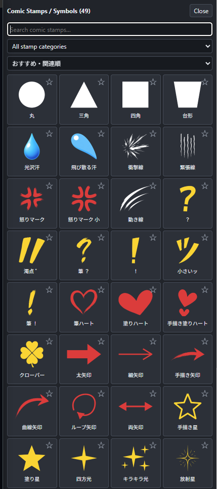

`Browse Shapes…`、`Browse SFX…`、`Browse Stamps…`、`Browse Frames…` から、各素材の一覧を開けます。

- 検索欄で素材名やキーワードを絞り込めます。
- カテゴリを選択し、用途や素材種別で表示を絞り込めます。
- `おすすめ・関連順`、`使用回数順`、`名前順`で並べ替えできます。
- 各カード右上の星を押すと、お気に入りの登録／解除ができます。
- お気に入り素材はEditor左側の簡易一覧へ優先的に表示されます。
- 素材カードをクリックすると、現在のキャンバスへ新しいレイヤーとして追加され、使用回数にも反映されます。
- お気に入りと使用回数は、選択中の生成画像と単体エディターで共通です。

## Editorの共通UI

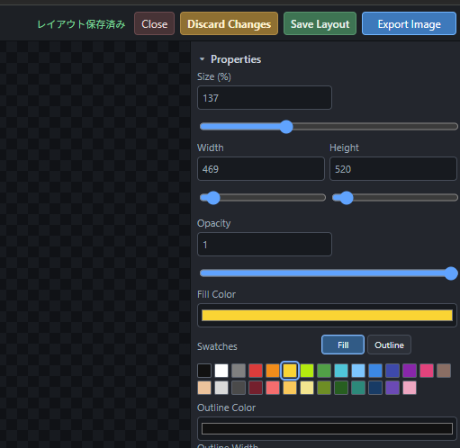

選択中の生成画像と単体エディターは編集ドキュメントと保存領域が別ですが、Editorの基本UIと操作方法は共通です。選択しているレイヤーの種類によって、Propertiesに表示される項目だけが切り替わります。

- 中央のキャンバスでレイヤーの移動、拡大縮小、回転、複数選択を行います。
- `Properties` ではサイズ、幅、高さ、不透明度、塗り色、アウトライン色などを調整できます。設定項目はText、Speech Bubble、SFX、Stamp、Frame、Emphasis Linesごとに異なります。
- `Layers` では重なり順、表示、ロック、名前、グループ化を管理します。
- 上部には編集状態と保存状態が表示され、Undo / Redo、表示倍率、画像読込、保存、書き出しを操作できます。

### 上部ボタン

- **Close**: Editorを閉じます。自動保存ONなら現在の編集ドキュメントの下書きを保持します。
- **Discard Changes**: 現在の下書きだけを破棄し、最後に明示保存したレイアウトへ戻します。
- **Save Layout**: レイアウトJSONだけを保存します。画像は書き出しません。
- **Export Image**: 選択枠を除いた現在のCanvas表示を正本として、設定形式の合成画像を書き出します。明示保存レイアウトは変更しません。

`Export Image`は主要色、`Save Layout`は通常色、`Discard Changes`は警告色です。

### 主要パネル／操作パッド

| パネル／パッド | 役割 |
|---|---|
| Forge起動パネル | 選択中の生成画像用または単体編集用のドキュメントを開きます。 |
| 上部ツールバー | 画像読込、Undo／Redo、表示倍率、レイアウト保存、画像書き出し、終了を操作します。 |
| 素材パネル | Speech Bubble、SFX、Stamp、Frame、Text、Emphasis Linesを追加します。 |
| Canvas | レイヤーの選択、移動、拡大縮小、回転、複数選択を行います。 |
| Properties | 選択レイヤーのサイズ、色、アウトライン、不透明度、影、グローなどを編集します。 |
| Layers | 重なり順、表示、ロック、名前、グループを管理します。 |
| Fill／Outlineパッド | 共通スウォッチの適用先をFillまたはOutlineへ切り替えます。 |
| Drop Shadow方向パッド | 3×3の矢印でShadow X／Yの方向を設定し、中央でオフセットを0へ戻します。X／Y／Blur欄で微調整できます。 |
| User Presetプレビューパッド | `標準`／`拡大`、背景色／任意画像、全体表示／100%／中央へを切り替えます。 |
| Settingsパネル | User Presets、保存、Editorレイアウト、キャッシュ、診断を管理します。 |

## 編集モードと保存領域

素材カタログ、お気に入り、使用回数、フォント、Settingsは共通です。背景画像、配置レイヤー、キャンバスサイズ、Undo / Redo、選択状態、明示保存レイアウト、自動保存下書きは編集モードごとに分離します。

### 選択中の生成画像を開く

- 画像内容のSHA-256を識別子として使用します。
- 同じ画像はForge再起動後やtxt2img / img2img切替後も復元します。
- 新しい画像へ別画像のレイアウトを自動適用しません。

### 単体エディターを開く

- 新しい単体編集ドキュメントとして、画像・配置レイヤーとも空の状態で開きます。
- 前回の単体編集がある場合は、新規で開くか再開するかを選択できます。
- 生成画像側の吹き出し、SFX、Stamp、Frameを引き継ぎません。
- ローカル画像を読み込んでも単体編集側の保存領域を維持します。
- 同じ画像の保存済みレイアウトが見つかった場合だけ、単体編集側へコピーして復元できます。

明示保存レイアウトはForgeの `config/speech-bubble-forge/layouts`、編集中の下書きはブラウザーのlocalStorageへ保存します。

## レイヤーパネル

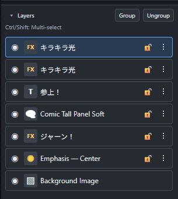

- 一覧の上側にあるレイヤーほど、キャンバスでも手前へ表示されます。
- レイヤーをクリックして選択し、Ctrl / Shiftを使って複数選択できます。
- `Group` / `Ungroup`で複数レイヤーをまとめたり解除したりできます。
- 各行から表示切替、ロック、その他のレイヤー操作を行えます。
- Properties / Layers間の分割線をドラッグして高さを変更できます。
- 変更した高さはブラウザーに記憶され、次回も復元されます。
- 未設定時は1920×1200表示を基準に、Layers領域を広めに確保します。

## 縦書きテキスト

縦書きは文字をgrapheme cluster単位で処理し、各文字を実際の描画範囲（alpha境界）でセル中央へ配置します。半角数字やLatin文字も字形の幅に左右されず中央へ揃い、結合濁点、Variation Selector、ZWJを含む文字列を途中で分割しません。

- 長音記号、横棒、括弧、三点リーダー、コロン／セミコロンは縦組みに合わせて90度時計回りに描画します。
- 句読点と小書き仮名は縦組み用の右上位置へ補正します。
- `vertical-rl`は右から左、`vertical-lr`は左から右へ列を配置します。
- 縦書きでもUnderlineは列の外側、Strikethroughは列の中央へ描画されます。
- Editor CanvasとPython／Pillow互換レンダラーは同じ文字分類、行送り、列送り、補正方向を使用します。
- 既存レイアウトJSONへ新しい項目は追加されません。保存済みの縦書きTextレイヤーへそのまま適用されます。

## Emphasis Lines（集中線）

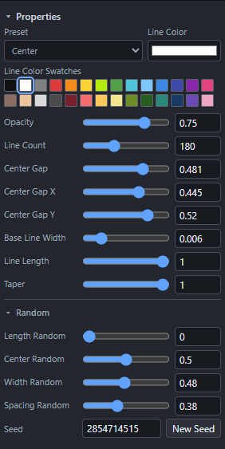

- `Frames` の下、`+ Text` の上へ2件を表示します。お気に入りを優先し、未登録時はCenter / Wideを表示します。
- プリセットはCenter / Wide / Tall / One Sideを収録しています。
- PNG素材ではなく、最大500本の四角形ポリゴンを動的生成します。
- Center Gapで中央空白をまとめて調整し、Center Gap X / Yで縦横を微調整できます。3項目とも最大0.65です。
- Line Color Swatches、Opacity、線数、線幅、長さ、中心位置、各Random値、Seedを編集できます。
- RandomとPrecise Center Positionは折りたたみ式で、中心位置の再設定やSeedの更新に対応します。
- 集中線本体はキャンバス上のクリックを遮らず、Layers一覧から選択します。
- 選択時の黄色ハンドルをドラッグして集中点を移動できます。
- 生成済みraysをレイアウトJSONへ保存し、Canvas表示と書き出しで同じ座標を使用します。

## User Presets — SFX／Comic Stampの作成・編集

Settingsの`User Presets`から、ユーザー作成の画像をOnomatopoeia / SFXまたはComic Stamps / Symbolsへ登録できます。

### SFX／スタンプを作成・管理

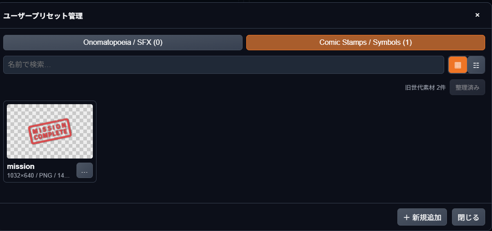

透過PNG／静止WebPからSFXまたはComic Stampを作成できます。管理画面では登録素材を検索し、再編集、画像の差し替え、別名保存、削除を行えます。追加・変更・削除は即時保存され、`Apply settings`は不要です。

- 対応形式はPNGと静止WebP、最大容量は4MB、元画像は最大2,500万画素、推奨は長辺512px程度です。
- 長辺768pxを超える画像は、任意で長辺768pxへ縮小できます。未選択なら元サイズのまま登録できます。
- 大きな画像を元サイズで多数登録すると、保存容量、メモリ使用量、Canvas表示、Export処理の負荷が増える場合があります。通常は長辺768pxへの縮小を推奨します。
- 透明部分がない画像の登録は明示確認が必要です。

### 色・アウトライン・効果を再編集

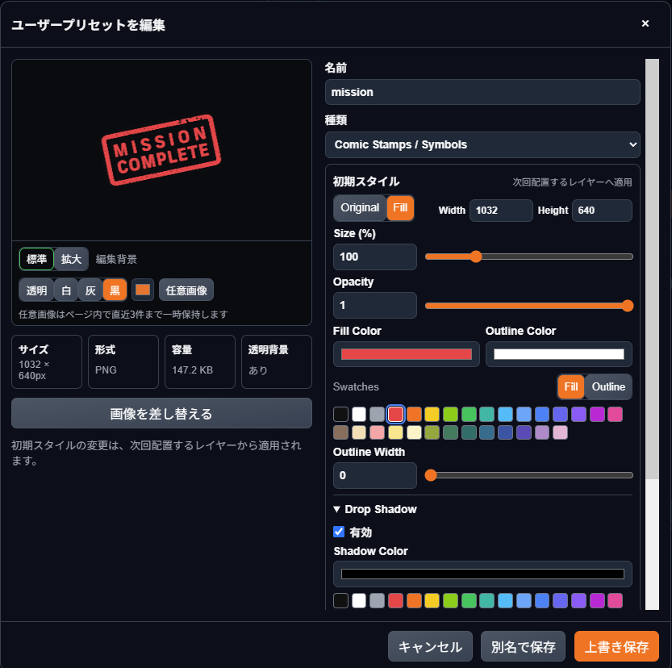

登録後も名前、種類、素材画像、配置時のSize／Width／Height／Opacityを編集できます。`Original`は元画像の色を保ち、`Fill`は画像の透明度を形状としてFill ColorとOutline Colorを適用します。Outline Width、Drop Shadow、Outer Glowも保存でき、次回配置するレイヤーの初期スタイルとして使用されます。

- 追加・編集画面はプレビューと設定の2カラム構成です。左側のプレビューを表示したまま、右側のコンパクトな設定欄をスクロールできます。画面の高さが不足する場合は左側も個別にスクロールできます。名前、種類、配置時のSize／Width／Height／Opacity、Original／Fill、Fill／Outline、Outline Width、Drop Shadow、Outer Glowを保存し直せます。Fill／Outline／Shadow／Glowは共通カラーパレットから選択できます。
- 登録する素材画像のドロップ／ファイル選択欄は`標準`表示だけにコンパクト表示し、`拡大`表示ではプレビュー面積を優先して非表示にします。素材画像を変更するときは`標準`へ戻してください。選択時は画像を一度だけデコードして透明部分の確認とプレビューへ共有し、API送信用のBase64変換は登録時まで遅延します。

### 標準／拡大プレビュー

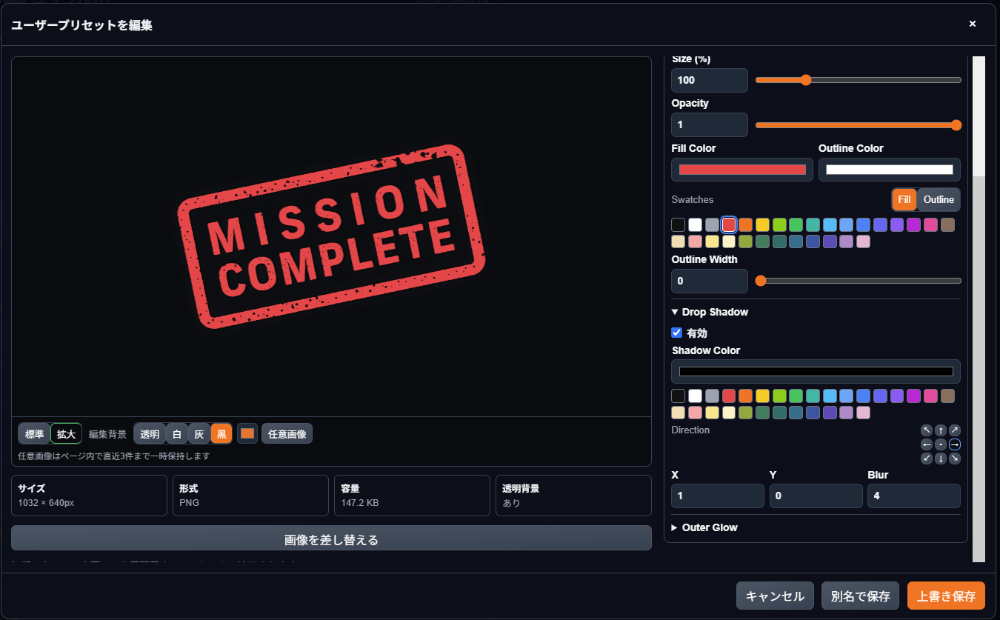

左側のプレビューを見ながら、右側でFill／Outline、Drop Shadow、Outer Glowを調整できます。`標準`表示は素材の差し替えと全体確認、`拡大`表示は輪郭・影・グローの細部確認に向いています。プレビュー背景は透明／白／灰／黒、任意色、任意画像へ切り替えられ、表示確認だけに使用されます。

- プレビュー背景は編集確認専用の`透明`／`白`／`灰`／`黒`、カラーピッカー、`任意画像`から選択できます。`任意画像`は登録素材の差し替えではありません。背景画像のファイル選択、プレビューへのドラッグ＆ドロップ、プレビューを選択した状態での`Ctrl+V`貼り付けに対応します。
- 任意画像はPNG／JPEG／WebP（1画像32MB以下）をページ内で直近3件まで一時保持し、追加画面と編集画面で再利用できます。個別削除と全消去が可能で、4件目の追加時は最も古い画像を解放します。プリセット、localStorage、IndexedDB、ディスクへは保存せず、`Ctrl+F5`またはページ終了時に消去されます。カラーピッカーの色だけはブラウザーへ保存します。
- 表示領域はプレビュー直下左端の`標準`／`拡大`で切り替えます。選択中の表示モードは緑で表示し、ダイアログを閉じると`標準`へ戻ります。`全体表示`／`100%`／`中央へ`は任意画像を背景に選んだ場合だけ表示します。マウスホイールズーム、背景のドラッグ移動、スタンプの確認位置へのドラッグにも対応します。スタンプ上から背景を移動する場合は`Shift`＋ドラッグまたは中ボタンドラッグを使います。背景とスタンプは常に同じ倍率で描画され、Width／Heightに対する実画像比率を維持します。
- 背景色、任意画像、表示倍率、背景位置、プレビュー内のスタンプ位置は編集確認専用です。プリセット、配置済みレイヤー、Canvas、Exportには保存・反映されません。本格的な配置はメインEditorで行います。
- 登録、名前・種類・初期スタイル変更、画像差し替え、削除は即時保存され、`Apply settings`は不要です。初期スタイルの変更は次回配置分から適用され、配置済みレイヤーは変わりません。
- 登録素材は素材ブラウザーの`My Presets`へ表示され、クリックまたはドラッグで既存SFXレイヤーとして配置できます。
- 配置後は既存素材と同じ移動、拡大縮小、回転、Opacity、Drop Shadow、Outer Glow、Undo / Redoを使用します。
- User PresetレイヤーはPropertiesの`Original / Fill`で表示を切り替えられます。Originalは元の色を保持し、Fillは透明度を形状としてFill Color／Outline Colorを適用します。
- 画像差し替えやプリセット削除後も、配置済みレイヤーが参照する旧画像は保持されます。
- 同名登録時は既存プリセットの種類と名前を表示し、`既存を編集`、`既存を置換`、`別名で保存`から選択できます。
- 管理画面の`旧世代素材`は、現在使われていない画像世代を`archive/`へ整理します。Archive内も読み込み対象になるため、旧画像を参照する過去レイアウトは維持されます。

ユーザー画像は拡張リポジトリ内ではなく、Forgeユーザーデータ領域の`config/speech-bubble-forge/user-presets/`へ保存します。Stability Matrix環境では、たとえば`<Forge-Neoパッケージ>\config\speech-bubble-forge\user-presets\`です。バックアップ時はこのフォルダー全体（`index.json`、`assets/`、`thumbnails/`、`archive/`）をコピーしてください。

同名の上書き保存はユーザープリセットだけが対象で、拡張に最初から含まれるBuilt-in／Templatesは管理画面から上書きできません。拡張本体のBuilt-in素材ファイルを直接編集した場合は、更新前に拡張フォルダーを別の場所へバックアップしてください。元へ戻すときは[GitHubリポジトリ](https://github.com/ukr8b3g-cmyk/sd-webui-speech-bubble-forge-neo)から再ダウンロードまたは再インストールできます。

## Settings > Speech Bubble Editor

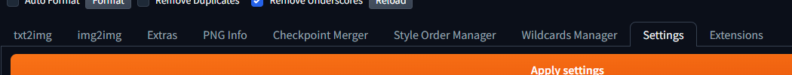

Forge Neo上部の `Settings` タブから設定とユーザー素材を管理できます。User Presetsだけ初期状態で開き、開閉だけでは設定変更扱いになりません。

txt2img／img2imgの生成画面にある`Speech Bubble Editor`起動パネルは、タブごとの開閉状態をブラウザーへ保存し、`Ctrl+F5`後も前回の状態を復元します。パネル内の`Speech Bubble Editor 設定を開く`からSettingsの該当項目へ直接移動できます。

- **User Presets**: 登録先選択、D&D／ファイル選択、件数、管理画面
- **Export & Saving**: 保存先、命名、日付フォルダー、世代バックアップ、PNG／JPEG／WebP品質、Overlay
- **Editor & Layout**: 初期ウィンドウ幅／高さ、Supersample、自動保存、画像ごとのレイアウト保持
- **Cache & Diagnostics**: ブラウザー編集キャッシュ、素材キャッシュ再構築、Self Diagnostics

Export & SavingとEditor & Layoutは横幅を使った2カラム配置で、Dropdown、Slider、数値欄、補足文を縦に詰めて表示します。

通常設定の変更後は`Apply settings`を押してください。User Presetの追加・変更・削除には不要です。Self Diagnosticsは必須ファイル、保存先、index、登録画像、素材キャッシュ、起動済みEditorの応答などを確認しますが、Editorの起動・再読込やデータの修復・削除は行いません。

### 保存先・ファイル名

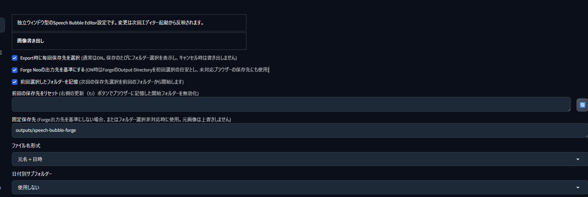

- Export時に毎回保存先を選択（初期ON）
- Forge Neoの出力先を基準にする／前回選択したフォルダーを記憶・リセット
- フォルダー選択非対応時の固定保存先
- ファイル名形式／日付別サブフォルダー

### 形式・品質・バックアップ

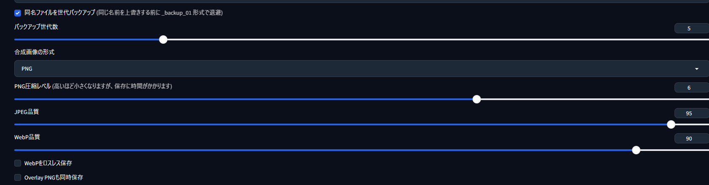

- 同名ファイルの世代バックアップ／世代数
- 合成画像の形式（PNG / JPEG / WebP）
- PNG圧縮レベル（互換レンダラー用）／JPEG品質／WebP品質・ロスレス
- Overlay PNGも同時保存（初期OFF）

### Editor・キャッシュ

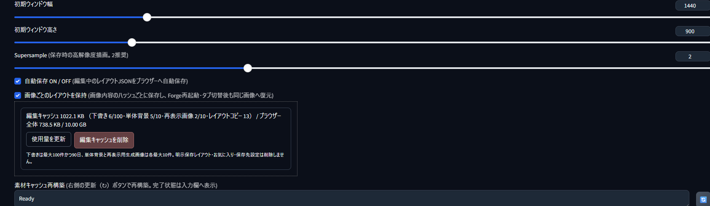

- 初期ウィンドウ幅／高さ
- Supersample（互換レンダラー用。EditorのExport Imageには適用されません）
- 自動保存 ON／OFF
- 画像ごとのレイアウトを保持
- ブラウザー編集キャッシュの使用量表示／削除
- 素材キャッシュ再構築

自動保存下書きは最大100件かつ更新後90日、単体Editorの背景画像と再表示用生成画像はそれぞれ最大10件に自動整理されます。生成画像の一時URLが失効した場合は、初回表示時に保持した画像を使って再オープンします。「編集キャッシュを削除」はブラウザー内の下書き、ローカルのレイアウトコピー、単体背景、再表示用生成画像を削除します。Forge側へ明示保存したレイアウト、お気に入り、素材、保存先設定は維持します。

## 画像書き出し

通常はExportのたびに保存先を選択します。前回選択したフォルダーをブラウザーへ記憶し、次回の選択開始位置として再利用します。キャンセル時は書き出しません。記憶した開始位置はSettingsの「前回の保存先をリセット」から無効化できます。

`Export Image`はEditorに実際に表示された選択枠なしのCanvas画像を直接保存します。文字位置、縦書き、アウトライン、Bold、アンチエイリアスを別エンジンで再描画しないため、PNGおよびロスレスWebPではEditor表示と同じ描画ピクセルを維持します。JPEGと非ロスレスWebPでは、保存形式の圧縮による画質差だけが発生します。

Canvas画像はBase64へ変換せずバイナリ送信します。Overlay保存がOFFの場合はOverlay用CanvasとPNGを生成しません。PNGおよびOverlay PNGはサーバーで再エンコードせず、Canvas Blobをそのまま保存します。この高速化による画質劣化はありません。SettingsのPNG圧縮レベルは互換レンダラーからの書き出しにだけ適用されます。

書き出し完了時は、合計、Canvas PNG生成、API往復、選択フォルダー保存の所要時間をEditorとForgeの状態表示へ表示します。詳細なサーバー解析・保存時間、ファイル容量、ダウンロード・書込み時間はブラウザーコンソールの`Speech Bubble export timings`で確認できます。

「Forge Neoの出力先を基準にする」がONの場合、Forgeの共通Output Directoryを優先し、未設定時はtxt2img / img2imgの出力先を使用します。ブラウザーのセキュリティ制限により、OS上のパスを初回から自動選択することはできません。初回だけForge出力先を手動で選択・許可すると、以後はそのフォルダーから開始します。フォルダー選択に非対応のブラウザーでは、Forge出力先（設定OFF時は固定保存先）へ直接保存します。

```text
*_YYYYMMDD_HHMMSS_*.(png|jpg|webp)
*_YYYYMMDD_HHMMSS_*_overlay.png  # 設定ON時・常に透過PNG
```

元画像は変更・上書きしません。同名ファイルがある場合は、設定に応じて `_backup_01` から指定世代まで退避します。日付別サブフォルダーは `YYYY-MM` または `YYYY-MM-DD` を選択できます。
ファイル名形式の「元名＋_edited」は、元画像との同名衝突を避けるため末尾へ `_edited` を付けます。

JPEGは透過を持てないため合成画像を白背景のRGBとして保存します。WebPは品質指定またはロスレスを選択できます。Overlayは後段の画像・動画合成で使用するため、合成画像の形式に関係なく透過PNGを維持します。書き出し完了はSpeech Bubble Editorの状態表示とForgeの通知へ表示し、Forge生成ギャラリーへ独自サムネイルや結果カードは追加しません。

## アセット方針

収録済みフルカラーPNG / WebPは完成アセットとして扱います。再描画、白黒化、マスク化、Tint、アウトライン焼き込み、減色、再圧縮は行いません。表示時の変形と、レイアウトに明示された効果だけを適用します。

## 実装・運用資料

- `docs/CHANGELOG_0.5.0.md`
- `docs/USER_PRESETS_V1_MANIFEST.md`
- `docs/CODEX_USER_PRESETS_V1_INSTRUCTIONS.md`
- `docs/INSTALL_USER_PRESETS_V1.md`
- `docs/USER_PRESETS_V1_MANUAL.md`
- `docs/API_USER_PRESETS_V1.md`
- `docs/SECURITY_USER_PRESETS_V1.md`
- `docs/USER_PRESETS_V1_TEST_PLAN.md`
- `docs/USER_PRESETS_V2_PLAN.md`

---

<a id="english"></a>

## English

[日本語](#日本語)

### Overview

Speech Bubble Editor for WebUI Forge Neo is a standalone Forge Neo extension based on the HTML editor and Pillow renderer from ComfyUI Speech Bubble Layer. ComfyUI is not required.

It provides speech bubbles, text, SFX, comic stamps, frames, emphasis lines, editable user presets, per-image layouts, standalone documents, browser drafts, and WYSIWYG image export.

### Installation

1. Download the [latest source ZIP](https://github.com/ukr8b3g-cmyk/sd-webui-speech-bubble-forge-neo/archive/refs/heads/main.zip) or clone the [GitHub repository](https://github.com/ukr8b3g-cmyk/sd-webui-speech-bubble-forge-neo).
2. Place the extension folder at:

   ```text
   stable-diffusion-webui-forge/
   └─ extensions/
      └─ sd-webui-speech-bubble-forge-neo/
   ```

3. Restart Forge Neo and refresh the browser with `Ctrl+F5`.

No additional pip packages are required. See [installation notes](docs/INSTALL_USER_PRESETS_V1.md), the [User Presets manual](docs/USER_PRESETS_V1_MANUAL.md), the [changelog](docs/CHANGELOG_0.5.0.md), and [verification checklist](VERIFICATION.md).

### Launch and editing modes

The Speech Bubble Editor panel is available in both txt2img and img2img.

- **Open selected generated image** opens the selected Forge gallery image with a layout stored by image SHA-256.
- **Open standalone editor** opens a separate `standalone:<UUID>` document. It can start empty or resume the previous standalone edit.
- Generated-image and standalone documents use the same Editor UI, but their backgrounds, layers, drafts, saved layouts, Undo/Redo state, and selection state remain separate.
- Both modes open in a separate window. The launcher reuses a live Editor window instead of opening duplicates.

### Main UI and control pads

| Panel / pad | Purpose |
|---|---|
| Forge launch panel | Opens the selected generated image or a standalone document. |
| Top toolbar | Loads images and controls Undo/Redo, zoom, layout saving, image export, and close. |
| Asset panel | Adds Speech Bubbles, SFX, Stamps, Frames, Text, and Emphasis Lines. |
| Canvas | Selects, moves, resizes, rotates, and multi-selects layers. |
| Properties | Edits size, colors, outline, opacity, shadow, glow, and type-specific options. |
| Layers | Manages stacking order, visibility, locking, names, and groups. |
| Fill / Outline pad | Selects whether a shared swatch changes Fill or Outline. |
| Drop Shadow direction pad | Sets Shadow X/Y with a compact 3×3 pad; the center resets the offset. |
| User Preset preview pad | Switches Standard/Expanded preview, background colors or a temporary image, Fit/100%, and centering. |
| Settings panel | Manages User Presets, export, Editor layout, cache, and diagnostics. |

Local PNG, JPEG, and WebP images can be loaded by drag-and-drop, file selection, or `Ctrl+V`. The loaded image becomes the background of the current document without merging the generated-image and standalone storage areas.

### Vertical text

Vertical text is processed by grapheme cluster. Each grapheme is rasterized with the selected font, cropped to its real alpha bounds including outline, and centered inside a fixed cell. This keeps narrow ASCII digits and Latin glyphs visually centered and prevents combining marks, variation selectors, and ZWJ sequences from being split.

- Prolonged sound marks, horizontal bars, brackets, ellipses, colons, and semicolons rotate 90 degrees clockwise.
- Japanese punctuation and small kana receive a top-right vertical-layout offset.
- `vertical-rl` places columns right-to-left; `vertical-lr` places them left-to-right.
- Vertical Underline is drawn outside the column, while Strikethrough is drawn through its center.
- Editor Canvas and the Python/Pillow compatibility renderer use the same orientation classes, cell geometry, and offset direction.
- Existing layout JSON remains compatible; no migration or new text field is required.

### User Presets

Settings > Speech Bubble Editor can create and manage SFX and Comic Stamp presets from PNG or WebP images. Presets can be renamed, recategorized, replaced, deleted, or edited again.

Initial placement styles include Original/Fill mode, Size, Width, Height, Opacity, Fill Color, Outline Color, Outline Width, Drop Shadow, and Outer Glow. The preview supports transparent, white, gray, black, custom-color, and temporary-image backgrounds. Up to three temporary preview images are retained only for the current page session.

User data is stored under:

```text
<Forge-Neo package>/config/speech-bubble-forge/user-presets/
```

Back up the complete folder, including `index.json`, `assets/`, `thumbnails/`, and `archive/`. Archived image generations remain readable so older layouts keep their original asset references.

### Settings and export

Settings > Speech Bubble Editor contains:

- **User Presets**
- **Export & Saving**
- **Editor & Layout**
- **Cache & Diagnostics**

`Export Image` saves the clean Editor Canvas without selection handles. PNG and lossless WebP preserve the Canvas pixels; JPEG and lossy WebP differ only by their selected compression. Canvas data is sent as multipart binary, Overlay generation is skipped when disabled, and PNG data is not re-encoded on the server.

The completion status reports total, Canvas PNG, API, and selected-folder save times. Detailed timing is available in the browser console as `Speech Bubble export timings`.

The original source image is never overwritten. Optional dated subfolders and `_backup_01` style generation backups are available. Overlay is always saved as transparent PNG when enabled.

### Project links

- [Repository](https://github.com/ukr8b3g-cmyk/sd-webui-speech-bubble-forge-neo)
- [Latest source ZIP](https://github.com/ukr8b3g-cmyk/sd-webui-speech-bubble-forge-neo/archive/refs/heads/main.zip)
- [Installation notes](docs/INSTALL_USER_PRESETS_V1.md)
- [User Presets manual](docs/USER_PRESETS_V1_MANUAL.md)
- [Changelog](docs/CHANGELOG_0.5.0.md)
- [Verification](VERIFICATION.md)
