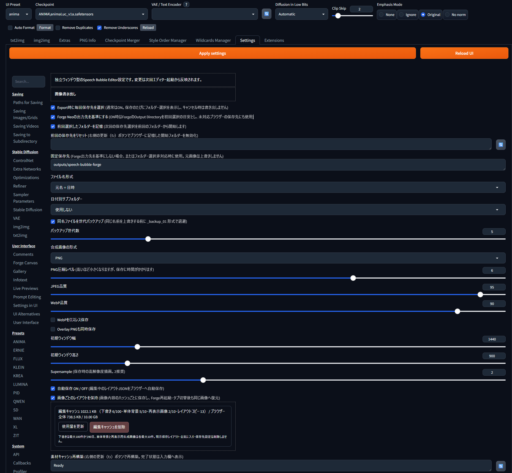

# Speech Bubble Editor for WebUI Forge Neo


Version: **0.4.0**

ComfyUI **Speech Bubble Layer** のHTMLエディターとPillow描画処理を、WebUI Forge Neoで単独動作するよう移植した拡張です。ComfyUIは不要です。

> [!IMPORTANT]
> 現在は開発版です。UI、保存形式、機能構成は今後変更される可能性があります。

## 主な機能

- Speech Bubble、SFX、Comic Stamp、Frame、Text、Emphasis Linesをレイヤーとして配置
- 移動、拡大縮小、回転、複数選択、グループ化、表示切替、ロック、Undo / Redo
- 素材のお気に入り表示と、検索・カテゴリ・並べ替えに対応した素材ブラウザー
- 画像ごとのレイアウト保存、単体編集用の独立した保存領域、自動保存下書き
- 背景込みの合成画像（PNG / JPEG / WebP）と、透過Overlay PNGを書き出し

## インストール

Forge Neoの `extensions` フォルダーで次を実行します。

```powershell
git clone https://github.com/ukr8b3g-cmyk/sd-webui-speech-bubble-forge-neo.git
```

またはGitHubからZIPをダウンロードし、展開したフォルダーを `extensions` 直下へ配置します。

```text
stable-diffusion-webui-forge/
└─ extensions/
   └─ sd-webui-speech-bubble-forge-neo/
```

Forge Neoを再起動し、ブラウザーを `Ctrl+F5` で更新してください。追加のpipインストールは不要です。

## Forge側UI


2つのボタンは同じEditor UIを開きますが、開く編集ドキュメントと保存領域は別々です。青いボタンはForgeの選択画像を画像ごとの編集領域で開き、緑のボタンは生成画像から独立した単体編集領域を開きます。片方の編集内容が、もう片方へ自動的に混ざることはありません。

- `Speech Bubble Editor` パネルをtxt2img / img2imgの **Script欄の直前**へ表示します。
- 上段の `選択中の生成画像を開く ↗` は、Forgeギャラリーで選択中の画像を、その画像専用の編集状態で開きます。
- 下段の `単体エディターを開く ↗` は、生成画像とは独立した新規または前回の単体編集を開きます。ローカル画像の編集はこちらを使用します。
- ギャラリー下へ **吹き出し＋斜めペン** アイコンを追加します。
- Editorは常に1ウィンドウだけです。再度押すと既存ウィンドウへフォーカスします。
- Forgeのライト／ダークテーマを自動検出してEditorへ反映します。

### 単体エディターの開始方法


前回の単体編集が残っている場合は、空の編集領域を作る `新規で開く` と、背景画像や配置レイヤーを復元する `前回の単体編集を再開` を選択できます。保存済みの単体編集がない場合は、この選択画面を表示せず新規状態で開きます。

## ローカル画像

`単体エディターを開く ↗` から開いたEditorへ、次の方法でローカル画像を読み込めます。

- `Open Image…` / `画像ファイルを選択`
- キャンバスへのドラッグ＆ドロップ
- `Ctrl+V` によるクリップボード画像の貼り付け

対応形式はPNG / JPEG / WebPです。ファイル選択後にポップアップを開かないため、ブラウザーが誤ってポップアップを遮断する問題を回避します。

## 素材ブラウザー


`Browse Shapes…`、`Browse SFX…`、`Browse Stamps…`、`Browse Frames…` から、各素材の一覧を開けます。

- 検索欄で素材名やキーワードを絞り込めます。
- カテゴリを選択し、用途や素材種別で表示を絞り込めます。
- `おすすめ・関連順`、`使用回数順`、`名前順`で並べ替えできます。
- 各カード右上の星を押すと、お気に入りの登録／解除ができます。
- お気に入り素材はEditor左側の簡易一覧へ優先的に表示されます。
- 素材カードをクリックすると、現在のキャンバスへ新しいレイヤーとして追加され、使用回数にも反映されます。
- お気に入りと使用回数は、選択中の生成画像と単体エディターで共通です。

## Editorの共通UI


選択中の生成画像と単体エディターは編集ドキュメントと保存領域が別ですが、Editorの基本UIと操作方法は共通です。選択しているレイヤーの種類によって、Propertiesに表示される項目だけが切り替わります。

- 中央のキャンバスでレイヤーの移動、拡大縮小、回転、複数選択を行います。
- `Properties` ではサイズ、幅、高さ、不透明度、塗り色、アウトライン色などを調整できます。設定項目はText、Speech Bubble、SFX、Stamp、Frame、Emphasis Linesごとに異なります。
- `Layers` では重なり順、表示、ロック、名前、グループ化を管理します。
- 上部には編集状態と保存状態が表示され、Undo / Redo、表示倍率、画像読込、保存、書き出しを操作できます。

### 上部ボタン

- **Close**: Editorを閉じます。自動保存ONなら現在の編集ドキュメントの下書きを保持します。
- **Discard Changes**: 現在の下書きだけを破棄し、最後に明示保存したレイアウトへ戻します。
- **Save Layout**: レイアウトJSONだけを保存します。画像は書き出しません。
- **Export Image**: 現在の状態から設定形式の合成画像を書き出します。明示保存レイアウトは変更しません。

`Export Image`は主要色、`Save Layout`は通常色、`Discard Changes`は警告色です。

## 編集モードと保存領域

素材カタログ、お気に入り、使用回数、フォント、Settingsは共通です。背景画像、配置レイヤー、キャンバスサイズ、Undo / Redo、選択状態、明示保存レイアウト、自動保存下書きは編集モードごとに分離します。

### 選択中の生成画像を開く

- 画像内容のSHA-256を識別子として使用します。
- 同じ画像はForge再起動後やtxt2img / img2img切替後も復元します。
- 新しい画像へ別画像のレイアウトを自動適用しません。

### 単体エディターを開く

- 新しい単体編集ドキュメントとして、画像・配置レイヤーとも空の状態で開きます。
- 前回の単体編集がある場合は、新規で開くか再開するかを選択できます。
- 生成画像側の吹き出し、SFX、Stamp、Frameを引き継ぎません。
- ローカル画像を読み込んでも単体編集側の保存領域を維持します。
- 同じ画像の保存済みレイアウトが見つかった場合だけ、単体編集側へコピーして復元できます。

明示保存レイアウトはForgeの `config/speech-bubble-forge/layouts`、編集中の下書きはブラウザーのlocalStorageへ保存します。

## レイヤーパネル

- Properties / Layers間の分割線をドラッグして高さを変更できます。
- 変更した高さはブラウザーに記憶され、次回も復元されます。
- 未設定時は1920×1200表示を基準に、Layers領域を広めに確保します。

## Emphasis Lines（集中線）

- `Frames` の下、`+ Text` の上へ2件を表示します。お気に入りを優先し、未登録時はCenter / Wideを表示します。
- プリセットはCenter / Wide / Tall / One Sideを収録しています。
- PNG素材ではなく、最大500本の四角形ポリゴンを動的生成します。
- Center Gapで中央空白をまとめて調整し、Center Gap X / Yで縦横を微調整できます。3項目とも最大0.65です。
- Line Color Swatches、Opacity、線数、線幅、長さ、中心位置、各Random値、Seedを編集できます。
- RandomとPrecise Center Positionは折りたたみ式で、中心位置の再設定やSeedの更新に対応します。
- 集中線本体はキャンバス上のクリックを遮らず、Layers一覧から選択します。
- 選択時の黄色ハンドルをドラッグして集中点を移動できます。
- 生成済みraysをレイアウトJSONへ保存し、Canvas表示とPillow書き出しで同じ座標を使用します。

## Settings > Speech Bubble Editor



Forge Neo上部の `Settings` タブから、書き出し、保存先、ウィンドウ、自動保存、編集キャッシュをまとめて設定できます。変更後は `Apply settings` を押してください。設定内容は次回のEditor起動から反映されるため、開いているEditorは一度閉じてから開き直します。

- Export時に毎回保存先を選択（初期ON）
- Forge Neoの出力先を基準にする／前回選択したフォルダーを記憶・リセット
- フォルダー選択非対応時の固定保存先
- ファイル名形式／日付別サブフォルダー
- 同名ファイルの世代バックアップ／世代数
- 合成画像の形式（PNG / JPEG / WebP）
- PNG圧縮レベル／JPEG品質／WebP品質・ロスレス
- 初期ウィンドウ幅／高さ
- Supersample（1～4）
- 自動保存 ON／OFF
- 画像ごとのレイアウトを保持
- ブラウザー編集キャッシュの使用量表示／削除
- Overlay PNGも同時保存（初期OFF）
- 素材キャッシュ再構築

自動保存下書きは最大100件かつ更新後90日、単体Editorの背景画像と再表示用生成画像はそれぞれ最大10件に自動整理されます。生成画像の一時URLが失効した場合は、初回表示時に保持した画像を使って再オープンします。「編集キャッシュを削除」はブラウザー内の下書き、ローカルのレイアウトコピー、単体背景、再表示用生成画像を削除します。Forge側へ明示保存したレイアウト、お気に入り、素材、保存先設定は維持します。

## 画像書き出し

通常はExportのたびに保存先を選択します。前回選択したフォルダーをブラウザーへ記憶し、次回の選択開始位置として再利用します。キャンセル時は書き出しません。記憶した開始位置はSettingsの「前回の保存先をリセット」から無効化できます。

「Forge Neoの出力先を基準にする」がONの場合、Forgeの共通Output Directoryを優先し、未設定時はtxt2img / img2imgの出力先を使用します。ブラウザーのセキュリティ制限により、OS上のパスを初回から自動選択することはできません。初回だけForge出力先を手動で選択・許可すると、以後はそのフォルダーから開始します。フォルダー選択に非対応のブラウザーでは、Forge出力先（設定OFF時は固定保存先）へ直接保存します。

```text
*_YYYYMMDD_HHMMSS_*.(png|jpg|webp)
*_YYYYMMDD_HHMMSS_*_overlay.png  # 設定ON時・常に透過PNG
```

元画像は変更・上書きしません。同名ファイルがある場合は、設定に応じて `_backup_01` から指定世代まで退避します。日付別サブフォルダーは `YYYY-MM` または `YYYY-MM-DD` を選択できます。
ファイル名形式の「元名＋_edited」は、元画像との同名衝突を避けるため末尾へ `_edited` を付けます。

JPEGは透過を持てないため合成画像を白背景のRGBとして保存します。WebPは品質指定またはロスレスを選択できます。Overlayは後段の画像・動画合成で使用するため、合成画像の形式に関係なく透過PNGを維持します。書き出し完了はSpeech Bubble Editorの状態表示とForgeの通知へ表示し、Forge生成ギャラリーへ独自サムネイルや結果カードは追加しません。

## アセット方針

収録済みフルカラーPNG / WebPは完成アセットとして扱います。再描画、白黒化、マスク化、Tint、アウトライン焼き込み、減色、再圧縮は行いません。表示時の変形と、レイアウトに明示された効果だけを適用します。
